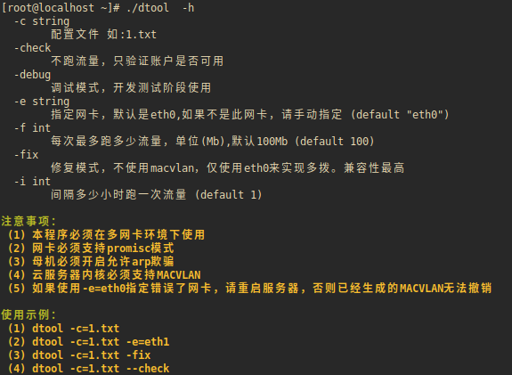

## 云服务器批量拨号&跑流量工具

>编译方法

1.下载仓库

    git clone https://github.com/gobkc/dtool.git

2.下载依赖

    export GOPROXY=https://goproxy.io
    go mod tidy
    go mod vendor

3.编译

    //普通编译
    go build
    //极限压缩编译
    go build -ldflags -w
    apt install upx
    upx dtool
    
> 应用截图
    
 